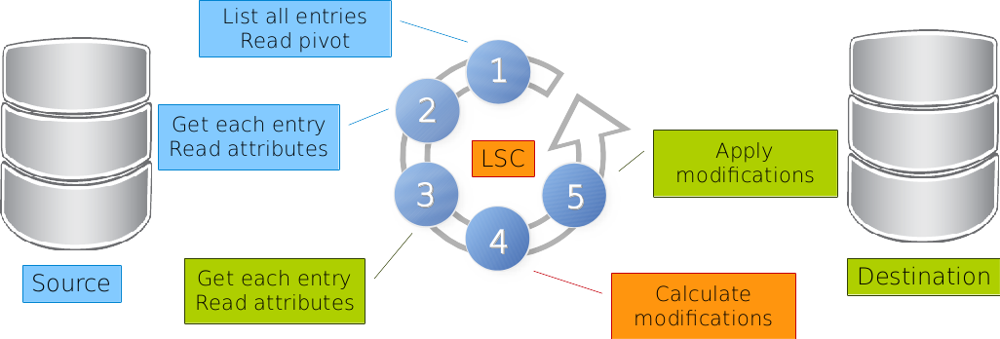
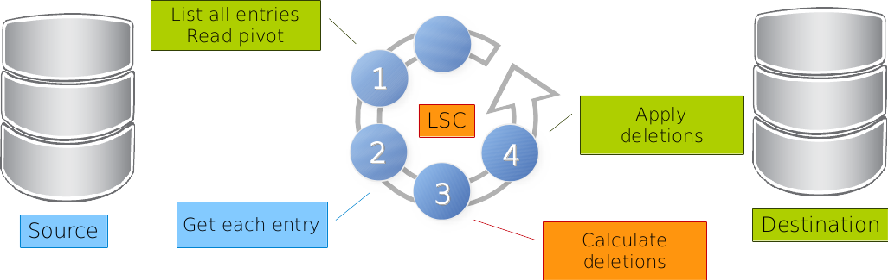

**********
LSC basics
**********

Run modes
=========

There's several run mode that you can use :
  * **synchronous mode** : this is the simplest way to start LSC. Once the source service has been listed, objects are retrieved from the source and from the destination. New objects are created, existing are updated and at the end the LSC will stop (no more daemon or program running)
  * **clean mode** : this mode is complementary to the first one for cleaning the destination service by retrieving objects and checking their existence inside the source service. If they exist nothing is done but if they don't they are deleted from the destination service.
  * **asynchronous mode** : in this mode, LSC is started as a daemon. If the source service has something to synchronize, LSC will retrieve updated objects one by one and will synchronize it wich the destination service. If no update is provided, LSC will sleep for 5 seconds and try again. It will never stop until an explicit request is done.

Phases
======

There are two phases:

* Sync phase: LSC will add/modify/rename entries in destination
* Clean phase: LSC will delete entries from destination

Sync phase
==========

- All entries are read in source. This is done with ``getAllFilter`` for LDAP, ``requestNameForList`` for Database or ``listScript`` for executable plugin. The values of attributes defined in ``pivotAttributes`` (in the source) are read.
- For each entry found at step 1, the pivot values are used to get the entry in source and values of attributes defined in ``fetchedAttributes`` are read (in the source). This is done with ``getOneFilter`` for LDAP, ``requestNameForObject`` for Database or ``getScript`` for executable plugin (in the source).
- For each entry found at step 1, the pivot values (from the source) are used to get the entry in destination and values of attributes defined in ``fetchedAttributes`` are read (in the destination).  This is done with ``getOneFilter`` for LDAP, ``requestNameForObject`` for Database or ``getScript`` for executable plugin (in the destination).
- Attributes and values found at step 2 are placed in ``srcBean``, and those found at step 3 are in ``dstBean``. The synchronizations rules are run and LSC calculate modifications.
- The modification are applied on the destination, if associated ``conditions`` are true.

Clean phase
===========

- All entries are read in destination. This is done with ``getAllFilter`` for LDAP, ``requestNameForList`` for Database or ``listScript`` for executable plugin. The values of attributes defined in ``pivotAttributes`` (in the destination) are read.
- For each entry found at step 1, the pivot values (from the destination) are used to get the entry in source.  This is done with ``cleanFilter`` for LDAP, ``requestNameForClean`` for Database or ``getScript`` for executable plugin.
- If no corresponding entry is found in source, LSC tag the destination entry for deletion.
- The delete are applied on the destination, if ``delete`` condition is true.

