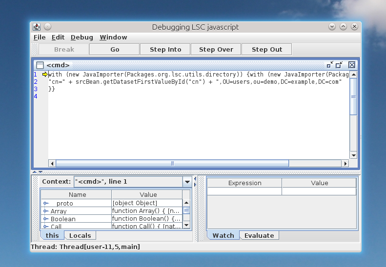

*********
Scripting
*********

You can use script in several locations of ``lsc.xml``:

* <mainIdentifier>
* <conditions>
* <dataset>

Supported scripting language are:

+--------------+-------------+------------------------------+----------------------+----------+
| Java version | LSC Version |     Default JS engine        |  Prefix syntax       | Default  |
+==============+=============+==============================+======================+==========+
| Java 8       | LSC 2.1     | Jscript evaluator            | **js:**              | **js:**  |
+--------------+-------------+------------------------------+----------------------+----------+
| Java 11      | LSC 2.2     | GraalJS or Jscript evaluator | **js:** or **gjs:**  | **gjs:** |
+--------------+-------------+------------------------------+----------------------+----------+
| Java 17      | LSC 2.2     | GraalJS or RhinoJS           | **gjs:** or **rjs:** | **gjs:** |
+--------------+-------------+------------------------------+----------------------+----------+
| Java 21      | LSC 2.2     | GraalJS or RhinoJS           | **gjs:** or **rjs:** | **gjs:** |
+--------------+-------------+------------------------------+----------------------+----------+

Each block of script must be prefixed like in the following example (here, using **RhinoJS**):

.. code-block:: XML

 	<string>
		<![CDATA[rjs:
			var carl = srcBean.getDatasetValuesById("carLicense");
			var result = new java.util.ArrayList();
			for (var i=0;i<carl.size(); i++) {
				result.add(carl[i]);
			}	
			result.toString();
		]]>
	</string>

If no prefix is provided, the engine will use the default value.

Scripting does not hgave to start with **CDATA**. Here is a single liner example, 
where we concatanate two strings, one of them being pulled from an attribute value:

.. code-block:: XML

	<dataset>
		<name>userPassword</name>
		<policy>FORCE</policy>
		<forceValues>
			<string>"secret" + srcBean.getDatasetFirstValueById("cn")</string>
		</forceValues>
	</dataset>

This snippeyt of code will use **Jscript evaluator** engine if ran on **Java 8**, and **GraalJS** engine if ran on Java **11**, **17** or **21**.

LSC objects
===========

You have access to LSC objects in script:

* srcBean: source entry
* dstBean: destination entry

Variables
=========

Some variables are provided by LSC and can be used in script:

* nocreate: dry run flag for create
* noupdate: dry run flag for update
* nodelete: dry run flag for delete
* nomodrdn: dry run flag for modrdn

External files
==============

You can load an external file and use functions inside your LSC script, thanks to ``<scriptInclude>`` markup.

For example, at the end of a task definition, insert:

.. code-block:: XML

    <task>
    
    ...
    
    <scriptInclude>
      <string>test.js</string>
    </scriptInclude>
    
    </task>

.. tip::

    You can add several files, by adding other ``<string>`` values

The file ``test.js`` must be in the configuration directory, else you should set the relative path (for example ``../test.js``) if the file is in another location.

Dummy example:

.. code-block:: js

    function test() {
            return "test-->";
    }

Then this method can be used in a dataset, for example:

.. code-block:: XML

    <dataset>
      <name>carLicense</name>
      <policy>FORCE</policy>
      <forceValues>
        <string>
          js:test()+srcBean.getDatasetFirstValueById(carLicense)
        </string>
     </forceValues>
    </dataset>

.. note::

    If the extension is .js, it is assumed to be a javascript file.
    It the extension is .groovy, .gvy .gy or .gsh, it is assumed to be a groovy file.

Debugger
========

You can launch Rhino debugger by using ``rdjs:`` instead of ``rjs:`` or ``js:``. This will open this window:

|

.. tip::

    Launch LSC in a single thread (option ``-t 1``) to avoid multiple debug windows.

